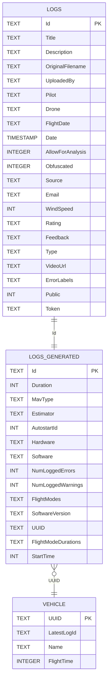

# Data Schema

Source of truth: `app/setup_db.py` (SQLite schema + in-place migrations).

## Overview

The application persists flight log information across three tables:
- `Logs`: upload/user metadata and moderation fields
- `LogsGenerated`: extracted ULog-derived metadata for fast browse/search
- `Vehicle`: per-vehicle rollup information

## Entity Relationship Diagram

## Tables

## `Logs`

Primary key: `Id`

| Column | Type | Notes |
|---|---|---|
| Id | TEXT | Log id (part of file name), primary key |
| Title | TEXT | Reserved/optional title |
| Description | TEXT | User-provided description |
| OriginalFilename | TEXT | Uploaded file name |
| UploadedBy | TEXT | Uploader identity |
| Pilot | TEXT | Pilot identity |
| Drone | TEXT | Drone identifier/name |
| FlightDate | TEXT | Flight date (`YYYY-MM-DD`) |
| Date | TIMESTAMP | Upload timestamp |
| AllowForAnalysis | INTEGER | `1` allows statistical analysis |
| Obfuscated | INTEGER | Obfuscation flag |
| Source | TEXT | E.g. `webui`, `CI`, `QGroundControl` |
| Email | TEXT | Optional contact email |
| WindSpeed | INT | Beaufort scale |
| Rating | TEXT | User-provided flight rating |
| Feedback | TEXT | Additional feedback |
| Type | TEXT | Upload type (`personal`, `flightreport`, etc.) |
| VideoUrl | TEXT | Optional associated video URL |
| ErrorLabels | TEXT | Comma-separated error label IDs |
| Public | INT | `1` means publicly listable |
| Token | TEXT | Security token (currently used for delete workflow) |

## `LogsGenerated`

Primary key: `Id`

| Column | Type | Notes |
|---|---|---|
| Id | TEXT | Log id (matches `Logs.Id`) |
| Duration | INT | Logging duration in seconds |
| MavType | TEXT | Vehicle type |
| Estimator | TEXT | Estimator identifier |
| AutostartId | INT | Airframe config/autostart ID |
| Hardware | TEXT | Board/hardware |
| Software | TEXT | Software/git tag |
| NumLoggedErrors | INT | Count of logged errors (or higher severity) |
| NumLoggedWarnings | INT | Count of logged warnings |
| FlightModes | TEXT | Comma-separated flight mode IDs |
| SoftwareVersion | TEXT | Release version |
| UUID | TEXT | Vehicle UUID (`sys_uuid`) |
| FlightModeDurations | TEXT | Comma-separated `<flight_mode_id>:<duration_sec>` pairs |
| StartTime | INT | UTC timestamp from GPS log |

## `Vehicle`

Primary key: `UUID`

| Column | Type | Notes |
|---|---|---|
| UUID | TEXT | Vehicle UUID (`sys_uuid`) |
| LatestLogId | TEXT | Most recent uploaded log id |
| Name | TEXT | Vehicle name from uploader |
| FlightTime | INTEGER | Latest known flight time in seconds |

## Indexes

Defined in `app/setup_db.py`:

- `idx_logs_public_source_date` on `Logs(Public, Source, Date DESC)`
- `idx_logs_drone_date` on `Logs(Drone, Date DESC)`
- `idx_logs_pilot_date` on `Logs(Pilot, Date DESC)`
- `idx_logs_uploaded_by_date` on `Logs(UploadedBy, Date DESC)`
- `idx_logsgenerated_hardware` on `LogsGenerated(Hardware)`
- `idx_logsgenerated_software` on `LogsGenerated(Software)`

## Encoding Notes

- `ErrorLabels` is stored as a comma-separated string of numeric IDs.
- `FlightModes` is stored as a comma-separated string of numeric flight mode IDs.
- `FlightModeDurations` is stored as comma-separated `<mode_id>:<duration_sec>` entries.

## Schema Change Notes

Recent branch-specific additions (relative to `main` at the time):

- Commit `0429421126c715c1f5f83cff69780487d4717042` (`feature/metadata-foundation`)
  - Added `Logs.UploadedBy`, `Logs.Pilot`, `Logs.Drone`, `Logs.FlightDate`
  - Added indexes: `idx_logs_drone_date`, `idx_logs_pilot_date`, `idx_logs_uploaded_by_date`
  - Added runtime migration behavior by always running `setup_db.py` on app startup

Other current schema fields in `LogsGenerated` (`SoftwareVersion`, `UUID`, `FlightModeDurations`, `StartTime`) are also managed via in-place migration checks in `setup_db.py`.
